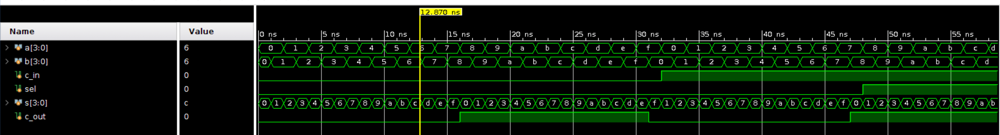
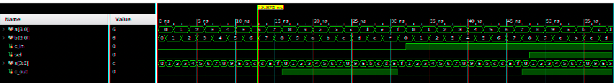

# 红蓝立体画制作

多媒体技术基础及应用自选练习2 红蓝立体画制作

## 实验目标

用代码实现红蓝立体画的制作，具体过程为：

1. 读取图片
2. 拆分RGB通道
3. 输出偏移后重组的图片

## 代码实现

使用了 Python 语言，NumPy PIL 和 SciPy 库配合完成。

### 读取图片并拆分 RGB 通道

```python
im = Image.open(sys.argv[1])
data = im.load()
(width, height) = (im.size[0], im.size[1])

rgb = np.zeros((width, height, 3), dtype=np.uint8)
for i in range(width):
    for j in range(height):
        r, g, b, _ = data[i, j]
        rgb[i][j][0] = r
        rgb[i][j][1] = g
        rgb[i][j][2] = b
```

### 生成图片

```python
new_rgb = np.zeros((height, width - 2 * diff, 3), dtype=np.uint8)
for i in range(width - 2*diff):
    for j in range(height):
        new_rgb[j][i][0] = rgb[i][j][0]
        new_rgb[j][i][1] = rgb[i+2*diff][j][1]
        new_rgb[j][i][2] = rgb[i+2*diff][j][2]

scipy.misc.imsave('output.png', new_rgb)
```

这里 `diff` 表示水平方向上的偏移，默认是 2 ，可以对代码进行修改。需要注意的是，由于不同的库对长宽的顺序不同，所以这里有一些微校的调整。

## 实验效果

原图：



效果图（diff=2）：



注意：不要长时间盯着效果图看，眩晕效果满分。